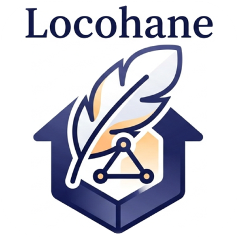
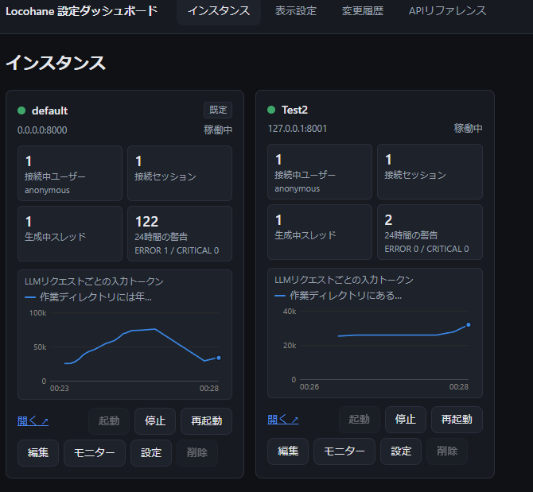

# Locohane-Agent（ローカルAIエージェント）



Locohane（ロコハネ）Agentは、**社内サーバーや手元のPCだけで動く AI エージェント**です。
ブラウザのチャット画面から話しかけるだけで、Excel・Word・PowerPoint・PDF の読み取りや作成、
画像の確認、フォルダ内の多数のファイルの一括処理などを、AI が手順を考えながら進めます。

- **完全オフライン**: AI モデルも自分のサーバーで動かすため、会話内容やファイルが外部へ送られません。
- **職場・グループで共有**: 1台のサーバーを複数の人が同時に使えます（ログイン機能あり）。
- **小さめのモデルでも安定**: 高価な大規模モデルでなくても作業をやり遂げられるよう、
  AI の暴走や誤操作を防ぐ仕組みを多数組み込んでいます。
- **「スキル」で仕事を覚える**: 業務手順を `SKILL.md` という手順書にまとめておくと、
  AI がそれを読んで同じやり方で作業します（Anthropic 公開の
  [Agent Skills 標準](https://agentskills.io/specification) に準拠）。

名前の由来：**Lo**cal（ローカル環境）+ 小羽（**cohane** / 軽量さ・和名っぽさ）

> 設計の詳細・設定項目の一覧・ディレクトリ構成などは
> [README_DETAIL.md](README_DETAIL.md)（管理者・開発者向け）にまとめています。

---

## 大切にしていること

設計業務のように**ミスが許されない専門業務**での利用を想定しています。そのため、
AI の性能の高さよりも「**何度やっても同じ結果になること（再現性）**」を優先しています。

- 書き込みやスクリプト実行など、ファイルを変更しうる作業は、**実行前に計画を提示し、
  あなたの承認を得てから**進めます。（自動承認設定も可）
- AI が任意のコマンドを打てる仕組み（汎用シェル等）は持たせていません。実行できるのは、
  あらかじめ用意されたスキルのスクリプトと、安全ガード付きの Python コードだけです。
- AI が自分で自分のスキルを書き換えることはしません。利用者が作ったスキルは
  「ドラフトスキル」として本人だけが使え、繰り返しの評価に合格し、開発担当者が承認してから
  正式に全員へ公開されます。

---

## できること

| 分野 | 内容 |
|------|------|
| Excel | 読み取り・新規作成・編集（書式・グラフ・画像・条件付き書式など）、数式の再計算、シートの画像化、VBA マクロの読み取り・編集・実行 |
| Word | 読み取り・新規作成・編集（検索置換・画像・変更履歴）、ページの画像化 |
| PowerPoint | 読み取り・新規作成・テンプレートの部分編集、スライドの画像化 |
| PDF | テキスト抽出・ページの画像化・PDF 作成（日本語対応） |
| 画像 | 画像の内容を見て説明・判断（画像に対応したモデルを使う場合） |
| 大量ファイル | フォルダ内の多数のファイルへ同じ処理を、複数の AI に分担させて並列実行 |
| 記憶 | 「覚えておいて」と伝えた内容を、別の会話でも思い出して活用（永続メモリー） |
| Web 検索 | Tavily API キーを設定した場合のみ利用可能（既定では外部通信なし） |
| 自分専用スキル | チャットで AI と相談しながら、自分専用の手順書（ドラフトスキル）を作成 |

同梱スキルの一覧は [README_DETAIL.md「同梱スキル」](README_DETAIL.md#同梱スキル) を参照してください。

---

## 必要なもの

- **OS**: Windows（Windows 11 で動作確認）
- **Python**: 3.11 の仮想環境
- **AI モデルの実行環境**: OpenAI 互換エンドポイントを提供する推論サーバー
  （[llama.cpp](https://github.com/ggml-org/llama.cpp) の `llama-server`・vLLM・Strata などで動作確認済み）と、
  そこで動かすモデルファイル
- **GPU**: 推奨（開発者は NVIDIA GeForce RTX 5060 Ti 16GB + Qwen3.6-35B-A3B で動作確認）

> **⚠️ モデルのライセンスに注意**
> 動かすモデルのライセンスはモデルごとに異なります。商用利用する場合は必ず確認してください
> （迷ったら Apache 2.0 のモデルが安全です）。

---

## はじめかた

詳しい手順・オプションは [README_DETAIL.md「セットアップと起動」](README_DETAIL.md#セットアップと起動) を参照してください。
Claude Code を使える場合は `/setup-locohane` で対話的にセットアップすることもできます。

### 1. Python 環境の指定と依存パッケージのインストール

プロジェクト直下の `python_env.bat` を開き、`PYTHON_DIR` を使う Python 仮想環境のフォルダに書き換えます。

```bat
set PYTHON_DIR=C:\path\to\your\python_env
```

続けて、コマンドプロンプトで依存パッケージをインストールします。

```cmd
call python_env.bat
python -m pip install -r requirements.txt
```

### 2. 推論サーバーを起動する

**OpenAI 互換エンドポイント**（`/v1/chat/completions`）を提供する推論サーバーであれば利用できます。
llama.cpp（llama-server）のほか、vLLM や Strata などの LLM サーバーでも動作確認済みです。

例：llama-server の場合（`http://localhost:8080/v1` で待ち受け）

```bash
llama-server --model C:\path\to\model.gguf --alias local-model --host 127.0.0.1 --port 8080 -c 8192
```

### 3. 管理ツールのログイン情報を用意する

`.env.example` をコピーして `.env` を作り、管理ツールへログインするユーザー名とパスワードを
`ADMIN_USERS` に設定します。

```
ADMIN_USERS=[["admin", "変更してください"]]
```

### 4. 起動する

```cmd
admin.bat
```

管理ツール（設定ダッシュボード）が `http://127.0.0.1:8001` で起動し、Locohane 本体も自動で起動します。

1. 管理ツールにログインし、「インスタンス」→「設定」→ `config.ini` タブで、
   AI の接続先（`main_url`）を手順2で起動した推論サーバーに合わせて保存し、インスタンスを再起動します。
2. ブラウザで `http://127.0.0.1:8000` を開くとチャット画面が表示されます。

---

## 使い方

### チャットで頼む

チャット欄に、やりたいことを普段の言葉で書いて送ります。

- 「この Excel ファイルの中身を要約して」
- 「このフォルダのPDFから、図面番号と改訂日を一覧表にしてExcelで出して」
- 「このWordの“旧社名”をすべて“新社名”に置き換えて、変更履歴を付けて」

AI がどのスキルを読み、どのツールを使っているかは、画面上に**ステップとして表示**されるので、
作業の進み具合を確認できます。ファイルはチャット欄に添付するか、下記の作業フォルダで指定します。

困ったときは「**使い方を教えて**」と聞くと、使い方の説明が表示されます。

### 計画を確認して承認する

ファイルの作成・変更を伴う作業では、着手前にチェックリスト形式の**実行計画**が提示されます。
内容を確認して「承認」すると実行が始まります。「拒否」すれば何も変更されません。

### 作業フォルダを選ぶ

チャット入力欄のフォルダアイコンから、AI に読み書きさせたいフォルダを**絶対パスで指定**できます
（新しい会話で最初のメッセージを送る前に設定します）。指定しない場合は、会話ごとの一時フォルダが使われます。
AI が書き込めるのは、この作業フォルダの中だけです。

### 結果を受け取る

作成・加工されたファイルは、チャット上に**ダウンロードボタン**として表示されます。
画像はその場でプレビュー表示されます。

### 過去の会話を再開する

画面左のサイドバーに過去の会話が一覧表示され、選ぶと続きから再開できます。
ログイン機能を有効にしている場合は、自分の会話だけが表示されます。

### 長い作業を止める

作業中は停止ボタンでいつでも中断できます。時間のかかる処理は、経過時間や途中経過がチャットに表示されます。

### 覚えてもらう

「この案件では図面番号は必ず○○形式で書く、と覚えておいて」のように伝えると、
次回以降の会話でもその内容を踏まえて作業します。

### 自分専用のスキルを作る

「いつもの手順をスキルにしたい」と相談すると、`skill-creator` スキルを使って
**あなた専用のドラフトスキル**を作れます。ドラフトは作成者本人の会話でだけ使え、
他の人には見えません（既定の設定の場合）。全員で使う正式スキルにしたい場合は、
スキルの管理担当者に昇格を依頼してください（繰り返しの評価に合格したものだけが正式化されます）。

---

## 管理者向け：設定ダッシュボード

`admin.bat` で起動する管理ツールでは、ブラウザ上から次の操作ができます。

- AI の接続先・各種設定の変更（テキストエディタ不要）
- ログインユーザーの追加・変更
- 画面のヘッダー・ウェルカムメッセージ・アイコンの変更
- Locohane-Agent を**複数のインスタンス**（別のモデル・別の部署向けなど）として同時に起動・停止・再起動
- 稼働状況・会話・ログの確認、設定の変更履歴の確認



詳しくは [README_DETAIL.md「設定ダッシュボード（管理ツール）」](README_DETAIL.md#設定ダッシュボード管理ツール) を参照してください。
ログイン認証・会話ログ・データの保存場所と削除方法・スキルの追加方法なども README_DETAIL.md にまとめています。

---

## データと外部通信

- 会話履歴・記憶・アップロードしたファイルなどは、すべてサーバー内の `data/` フォルダに保存されます。
- 既定では外部への通信は一切行いません。通信先は自分で用意した推論サーバーだけです。
  Web 検索スキルの API キーや、外部ツール連携（MCP サーバー）を自分で設定した場合のみ、
  それらが外部と通信することがあります。

詳しくは [README_DETAIL.md「外部通信について（完全オフライン保証）」](README_DETAIL.md#外部通信について完全オフライン保証) を参照してください。

---

## ライセンスと免責

本ソフトウェアは **MIT License** です（[LICENSE](LICENSE)）。依存パッケージはすべて商用利用可能な
ライセンスです（[THIRD_PARTY_LICENSES.md](THIRD_PARTY_LICENSES.md)）。

本ソフトウェアは「現状のまま」（as-is）で提供され、明示的または黙示的な保証はありません。
本ソフトウェアの使用により生じたいかなる損害についても、著作者または著作権者は責任を負いません。
商用利用時のチェックリスト等は [README_DETAIL.md「ライセンスと商用利用」](README_DETAIL.md#ライセンスと商用利用) を参照してください。

---

## 関連ドキュメント

| ドキュメント | 対象 | 内容 |
|-------------|------|------|
| [README_DETAIL.md](README_DETAIL.md) | 管理者・開発者 | 設計・ディレクトリ構成・設定リファレンス・運用の詳細 |
| [skills/SKILLS_README.md](skills/SKILLS_README.md) | スキル開発者 | スキルの書き方・規約 |
| [agents/README/AGENTS_README.md](agents/README/AGENTS_README.md) | 開発者 | サブエージェント種別の定義方法 |
| [mcp_server/MCP_README.md](mcp_server/MCP_README.md) | 開発者 | Locohane-Agent のスキルを MCP サーバーとして配布する方法 |
| [evals/README.md](evals/README.md) | 開発者 | 評価ハーネス（スキル安定化トライアウト）の使い方 |
